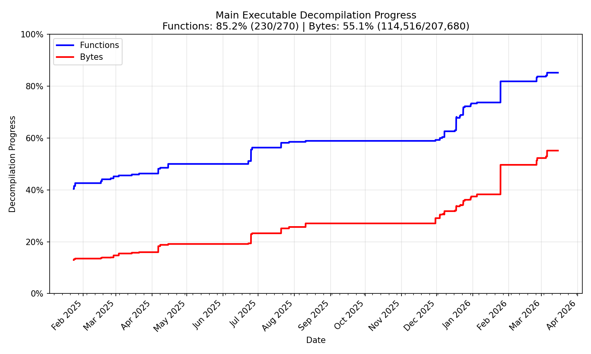

# Spyro the Dragon Decompilation Project

> [!WARNING]
> This project barely even started, while you can make some simple mods, the project evolving will probably throw a wrench into any mods you might actively be working on.

This project aims to decompile Spyro the Dragon to source code that will create a matching game executable. By achieving a byte-for-byte match, we can preserve the game and gain insights into its development.

I started this project late last year, I've been working on it on and off. Now that I've broken the 40% complete mark, I think it's time to make it public.

## Structure

- `src/`: Decompiled source code.
- `include/`: Include headers for source code, and headers used by disassembly tools.
- `assets/`: Contains binary assets included in the executable.
- `asm/`: Disassembly for non-matching code, and code originally written in assembly.
- `tools/`: Contains utilities for building the game.

## Target checksums

- `PSX.EXE`: 84E3728AB94720D0873E2514ADF4AADE4935E0C5 (SHA-1)
- `PSX.EXE`: A533D75CAB8AFAAE6107EC35A02A9A5FE979A92C7C955F9CF1EE50F693A1B998 (SHA-256)

## Progress

## Overlays

Overlays in the first two Spyro games are a bit of a mess. The initial focus won't be on matching those, but as soon as enough Moby classes have been implemented, an attempt to do so should be made.

Spyro 3 fans really got it good

## PSYQ

Because I had trouble getting the order of the PSYQ sections to match, PSYQ 4.0 libraries are included in its disassembled form. If you prefer the more modern PSYQ 4.7, it's possible to replace it, creating a non-matching build. To build with PSYQ 4.7, use `NEW_PSYQ=1 make all`.

Please put PYSQ headers in psyq/include, if you're using 4.7 you should put the lib folder in psyq/lib. Any version of PSYQ later than 4.0 should work.

## Building

To make it easier to setup the MIPS toolchain, a docker image is provided. Executing `docker_env.sh` starts a container in interactive mode with the Dockerfile image, which comes with modern mipsel- gcc and binutils. For the source code, a much older compiler will be used, gcc2.7.2-mipsel.

After starting the container, executing `make all` will create the main executable, named `PSX.EXE`, in the `/build` folder, and overlays in `/build/wad`.

To speed up the build process, you can use `make -j` followed by the number of threads you want to use, such as `make all -j6`.

The overlays will be output to `/build/wad`, the naming convention matches the Spyro 1 template of [wadtool](https://github.com/altro50/wadtool).

This project only concerns the game's code, not the data files.

A tool such as [wadtool](https://github.com/altro50/wadtool) is needed to rebuild the WAD.WAD file, you can use it for extracting and rebuilding. For creating the CD image, I would recommend [mkpsxiso](https://github.com/Lameguy64/mkpsxiso) because it's modern and capable of recreating the image perfectly. You can use [dumpsxiso](https://github.com/Lameguy64/mkpsxiso) to extract the contents of the original image.

## Acknowledgements

- [splat](https://github.com/ethteck/splat) and it's various [example projects](https://github.com/ethteck/splat/wiki/Examples).
- [spimdisasm](https://github.com/Decompollaborate/spimdisasm) disassembler used by splat
- [maspsx](https://github.com/mkst/maspsx)
- [decomp.me](https://decomp.me), a very handy tool for matching functions.

---

_Note: This project is a fan effort and is not affiliated with or endorsed by Sony Interactive Entertainment or Insomniac Games._

You got the shemp
