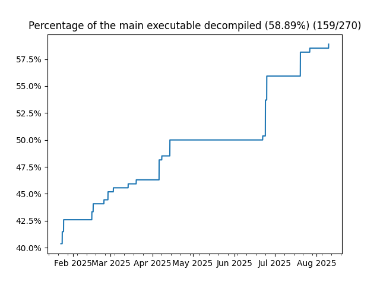

# Spyro the Dragon Decompilation Project

> [!WARNING]
> This project barely even started, while you can make some simple mods, the project evolving will probably throw a wrench into any mods you might actively be working on.

This project aims to decompile Spyro the Dragon to source code that will create a matching game executable.
By achieving a byte-for-byte match, we can preserve the game and gain insights into its development.

I started this project late last year, I've been working on it on and off.
Now that I've broken the 40% complete mark, I think it's time to make it public.

This project only concerns the game's code, not the data files.


## Structure

- `src/`: Decompiled source code.
- `include/`: Include headers for source code, and headers used by disassembly tools.
- `assets/`: Contains binary assets included in the executable.
- `asm/`: Disassembly for non-matching code, and code originally written in assembly.
- `tools/`: Contains utilities for building the game.
- `build/`: Build artifacts.

## Target checksums

- `PSX.EXE`: 84E3728AB94720D0873E2514ADF4AADE4935E0C5 (SHA-1)
- `PSX.EXE`: A533D75CAB8AFAAE6107EC35A02A9A5FE979A92C7C955F9CF1EE50F693A1B998 (SHA-256)
- See `sha256sum.txt` for overlays.

## Progress



## Overlays

Overlays in the first two Spyro games are a bit of a mess.
The initial focus won't be on matching those, but as soon as enough Moby classes have been implemented, an attempt to do so should be made.

Spyro 3 fans really got it good.

## Building

To make it easier to setup the MIPS toolchain, a docker helper script is provided which builds and starts an image.
Executing `docker_env.sh` starts a container in interactive mode with the Dockerfile image, which comes with modern `mipsel-` gcc and binutils.
For the source code, a much older compiler will be used `gcc2.7.2-mipsel`.

The rest of these instructions will assume you are using the Docker environment.

Artifacts:
- `./build/PSX.EXE` The main executable aka `SCUS_942.28`.
- `./build/wad` The overlays (naming conventions match the Spyro 1 template of [wadtool](https://github.com/altro50/wadtool))

### PSYQ

> [!WARNING]
> This repository does not provide the PSYQ headers. You must put the PYSQ headers in psyq/include. All PSYQ headers later than 4.0 will work.

Because I had trouble getting the order of the PSYQ sections to match, the PSYQ 4.0 libraries *are already included* in their disassembled form.
If you prefer to use the more modern PSYQ 4.7 libraries, it is possible to replace it, which creates a non-matching build;
Any version of PSYQ later than 4.0 should work fine.

1. Place PSYQ headers in `psyq/include`.
2. If using a different PSYQ version, place libraries in `psyq/libs`.
3. Ensure all file names are lowercase.

Note: MS COFF `.lib` files will *not work* and they must be converted to .a files to work with gcc.
Search up Arthus, they have a clean, gcc-compatible PSYQ 4.7 package with headers and libraries ready to go.

### Matching Build

If you are making a byte-for-byte matching build.

```bash
make all -j$(nproc)
```

### Non-Matching Build

If you are using the non-included PSYQ.

```bash
export NEW_PSYQ=1
make all -j$(nproc)
```

### Modern Compiler Non-Matching Build

If you want to use the modern compiler, you must provide your own libs.

```bash
export MODERN_COMPILER=1
export NEW_PSYQ=1
make all -j$(nproc)
```

## Extra Tools

- [wadtool](https://github.com/altro50/wadtool) can be used for extracting and rebuilding the WAD.WAD file.  
- [mkpsxiso](https://github.com/Lameguy64/mkpsxiso) is recommend for re-creating the CD image, as it is modern and capable of recreating the image perfectly.  
- [dumpsxiso](https://github.com/Lameguy64/mkpsxiso) can be used to extract the contents of the original image.  

## Acknowledgements

- [splat](https://github.com/ethteck/splat) and it's various [example projects](https://github.com/ethteck/splat/wiki/Examples).
- [spimdisasm](https://github.com/Decompollaborate/spimdisasm) disassembler used by splat
- [maspsx](https://github.com/mkst/maspsx)
- [decomp.me](https://decomp.me), a very handy tool for matching functions.

---

_Note: This project is a fan effort and is not affiliated with or endorsed by Sony Interactive Entertainment or Insomniac Games._

You got the shemp
